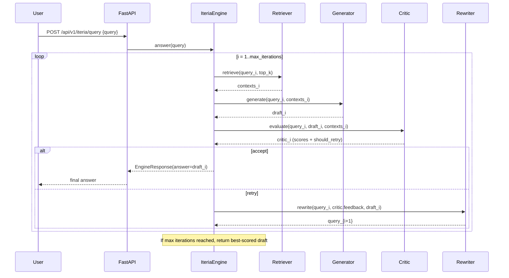

# Iteria — Core Architecture (Engine)

This document defines the **core (engine/core)** architecture you can follow as you build Iteria.
It’s designed so the agentic reasoning loop works even before the vector DB ingestion is complete.

## Responsibilities (core/)

- `retriever.py`
  - Input: query
  - Output: `RetrievedItem[]` (ranked chunks)
  - Default implementation: `SimpleLocalDocsRetriever` (fallback for local `data/docs/*.txt`)
  - Later: replace with vector-store retriever (Chroma/Pinecone) without changing engine logic

- `generator.py`
  - Input: query + retrieved chunks
  - Output: `DraftAnswer` (answer + citations)
  - Current implementation is **extractive** (quotes/summarizes retrieved text)
  - Later: swap in LLM-backed generator

- `critic.py`
  - Input: query + draft + retrieved chunks
  - Output: `CriticResult` with 3 scores + overall + retry decision
  - Enforces: groundedness, relevance, completeness

- `rewriter.py`
  - Input: query + critic feedback + draft
  - Output: rewritten query for the next iteration

- `engine.py`
  - Iteration controller:
    - retrieve → generate → critique → accept OR rewrite → repeat
    - stops at `max_iterations` or when critic accepts

## Data Contracts

All request/response objects live in `engine/models.py` (Pydantic models):

- `RetrievedItem`, `DraftAnswer`, `CriticResult`, `EngineResponse`, etc.

## Sequence Diagram



## Interface Layer (FastAPI)

FastAPI lives in `interfaces/fastapi/app.py` and exposes:

- `/api/v1/iteria/query`
- `/api/v1/iteria/retrieve`
- `/api/v1/iteria/generate`
- `/api/v1/iteria/evaluate`
- `/api/v1/iteria/rewrite`
- `/api/v1/iteria/health`

## Using uv (Package Manager)

From repo root:

```powershell
uv sync
uv run uvicorn interfaces.fastapi.app:app --reload --port 8000
```

### RAG extras (LangChain + spaCy + sentence-transformers + Chroma)

spaCy currently supports Python `3.10`–`3.13` (not `3.14`). If your system Python is `3.14`, create a `3.13` venv with `uv` first:

```powershell
uv python install 3.13
uv venv --python 3.13
```

```powershell
uv sync --extra rag
uv run python -m spacy download en_core_web_sm
```

### Ingest documents into Chroma

```powershell
uv run python -m engine.rag.ingest --docs-dir data/docs --reset
```

### Enable Chroma retriever for query-time

Set env vars (recommended):

```powershell
$env:ITERIA_USE_CHROMA_RETRIEVER = "true"
$env:ITERIA_CHROMA_PERSIST_DIR = "data/vector_db"
$env:ITERIA_CHROMA_COLLECTION_NAME = "iteria"
$env:ITERIA_EMBEDDING_MODEL_NAME = "sentence-transformers/all-MiniLM-L6-v2"
uv run uvicorn interfaces.fastapi.app:app --reload --port 8000
```

Then open:

- `http://127.0.0.1:8000/docs` (Swagger UI)

## Notes

- The current retriever is a **fallback** that searches local text files in `data/docs/`.
- As Ishan’s `engine/rag/*` vector store becomes ready, you only need to swap the retriever implementation.
